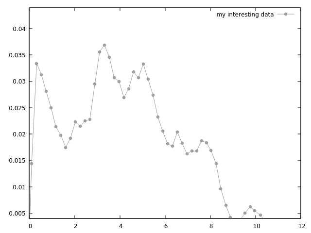
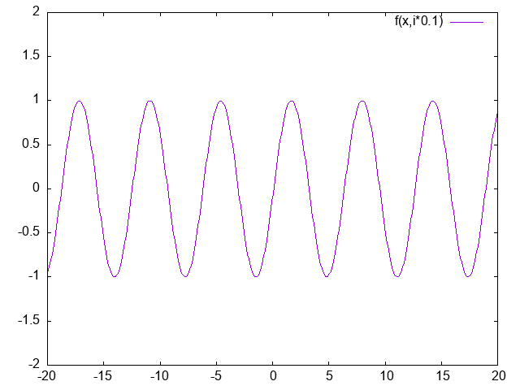

# Gnuplot 简易教程

:fire: 忽必烈李@bilibili:fire:

[TOC]

**Gnuplot** is a portable command-line-driven graphing utility for Linux, OS/2, MS Windows, OSX, VMS, and many other platforms.

The source code is copyrighted but freely distributed (i.e., you don’t have to pay for it).

It was originally created to allow scientists and students to visualize mathematical functions and data interactively but has grown to support many non-interactive uses such as web scripting.

It is also used as a plotting engine by third-party applications like Octave.

**FEATURE HIGHLIGHTS:**

| Interactive screen display:    | cross-platform (Qt, wxWidgets, x11) or system-specific (MS Windows, OS/2) |
| ------------------------------ | ------------------------------------------------------------ |
| Direct output to file:         | postscript (including eps), pdf, png, gif, jpeg, LaTeX, metafont, emf, svg, … |
| Mouseable web display formats: | HTML5, svg                                                   |

## 演示案例

### 下面从gnuplot/demo目录开始下面的教程

http://gnuplot.info/demos/

Gnuplot comes with a large collection of demonstration plots. You can step through these interactively by typing the command below in gnuplot's `demo/` directory — it should be part of your installation, otherwise get it from the [source code archive](http://sourceforge.net/project/showfiles.php?group_id=2055) or file-by-file from the [git repository](https://sourceforge.net/p/gnuplot/gnuplot-main/ci/master/tree/).

```
    gnuplot> load "all.dem"
```

Hint: you can get a single big PDF file of all the demo plots by the following sequence of commands, followed by hitting <enter> many times.

```
    gnuplot> set terminal pdf
    gnuplot> set output "all_demos.pdf"
    gnuplot> load "all.dem"
    gnuplot> 
```

More practical on systems with a linux-like shell is the single line command

```
    gnuplot -e "set term pdf" all.dem < /bin/yes > all_demos.pdf
```

### 外部演示案例

- [Wikimedia collection](http://commons.wikimedia.org/wiki/Category:Gnuplot_diagrams) of graphs made using gnuplot
- Examples of pm3d pictures and scripts by [Dr. Namio Matuda](http://ayapin-film.sakura.ne.jp/Gnuplot/pm3d.html).
- There are plots produced by gnuplot on [Octave homepage](http://www.octave.org/).

## 1.简单绘图

```sh
plot "data.dat" title "my interesting data"  linestyle 7 linecolor 0 with linespoints
```

采用`data.dat`绘图，标题为`my interesting data` 线型7，颜色0，点线绘图，结果如下



缩略写法

```sh
plot "data.dat" title "my interesting data"  lt7 lc 0 w lp
replot # 缩略 rep
```

设置图例

```sh
set key  
unset key
#缩略
set k
unset k
```

添加函数

```sh
plot "data.dat" title "my interesting data"  lt 7 lc 0 w p, 0.001*x lc 7 title "0.001x"
set output "2.png"
```

添加函数`0.001x`，绘制结果如下


绘制带errobar的图，绘图时采用第3列的error放大了10倍的数据

```sh
set term png
plot "dataError.txt" using 1:2:($3*10)  title "my interesting data"  lt 7 lc 0 with errorbars, sin(x) lc 7 title "sin(x) Model"
set output "3.png" #存储图片
```


```sh
test #查看线性等
```


## 2. 美化绘图

终端可设置为`qt、wxt、pngcairo`等

定制线型

``` 
set style line 1 lc rgb  "#8b0000" lw 2
set style line 2 lc 0 pointtype 7 pointsize 0.9
show style line
```

使用线型

```sh
plot "dataError.txt" using 1:2:($3*10)  title "my interesting data"  ls 1 lt 7 lc 0 with errorbars, sin(x) ls 2 lc 7 title "sin(x) Model"
```

plot 可缩略为p, using 可缩略为 us

设置图例

```sh
set key  bottom left box # 将图例放置在左下，box边框
set key width 1 #线宽1
set key font ",14" #字体及大小
set key at -9, -3.8  #设置图例放置位置
```

设置坐标轴

```sh
set grid  # 设置网格
set border 3 # 设置边框宽度
set tics nommirror # 设置右轴与上轴不显示
set xtics -10,0.5,10 # 设置ticks的间距，0.5
set xrange [-10:10] #设置x轴范围
set yrange [-4:4]
show variable pi #显示变量pi
a = 2  #设置变量
set xtics("0" 0,"{/Symbol p}" pi, "2{/Symbol p}" 2*pi)  #设置x ticks的显示标签pi
set tics font ",14"  #设置tick字体及大小
set xlabel "t/s" font ",16" #设置x轴标签，字体及大小
set xlabel offset -1  # 设置x轴标签的距离中心的偏移，左移动为负数，右移动为正数
set ylabe "Water level in meters" font ",16" offset -1 
rep #replot
```

存储为png图片

```sh
set term pngcairo size 1280,960
set output "4.png"

set logscale y #设置对数坐标系
```

美化后图像如下


## 3. 数据拟合

拟合原理：
$$
f(x) = a \cdot exp(bx) \\
s(x_i,y_i,a,b) = \sum_i(y_i-f(x_i,a,b))^2  \\
$$

sum of squared residual 残差和
$$
s(x_i,y_i,a,b)
$$

引入权重
$$
w_i=1/\sigma_i^2 \\
s(x_i,y_i,a,b) = \sum_i w_i (y_i-f(x_i,a,b))^2  
$$
数据拟合算法查看数字分析的教材

```sh
p "ExpdataError.txt" using 1:2 # 绘制数据图第1，2列
f(x)=a*exp(-b*x) #设置拟合函数
fit f(x) "ExpdataError.txt" using 1:2 via a,b #采用函数f(x)拟合，拟合参数a,b
p "ExpdataError.txt",f(x)

```

使用errorbar

```sh
p "ExpdataError.txt" using 1:2:3 with errorbars # 绘制数据图第1，2列,带errorbars
f(x)=a*exp(-b*x) #设置拟合函数
fit f(x) "ExpdataError.txt" using 1:2:3 yerrors via a,b #采用函数f(x)拟合，拟合参数a,b,第3列error
p "ExpdataError.txt" w errorbars,f(x) 
```

## 4. 动图制作

```sh
f(x,t)=sin(x-t)
set terminal gif animate delay 4
set output "test.gif"
set xrange [-20:20]
set yrange [-2:2]
do for [i=1:96]{plot f(x,i*0.1)}
set samples 200  #设置采样率，使得图像更光滑
set output "test2.gif"
set terminal gif animate delay 4
do for [i=1:96]{plot f(x,i*0.1)}
```



## 5. 热度图和向量

采用`generateHeat.py`生成磁场数据，输出到文件`potential_field.dat`

```sh
plot "potential_field.dat" with image  #绘制热度图
set xrange [0:100]
set yrange [0:100]
plot "potential_field.dat" w image  #绘制热度图
set size ratio 1  # 图片大小x/y=1
set tics out  #
set cbrange [-500:500] #设置pallete 范围【-500，500】 原【0，1000】
unset cbrange
```

设置调色板，参卡https://gnuplot.sourceforge.net/demo_5.4/pm3dcolors.html


```sh
set palette rgb 33,13,10 # rainbow
rep
plot "potential_field.dat" w image,"potential_field.dat" using 1:2:4:5 with vectors lc -1 filled  #绘制热度图,并添加向量
plot "potential_field.dat" w image,"potential_field.dat" using  1:2:4:5 every 5:5 with vectors lc -1 filled  #绘制热度图,并添加向量,每5行5列画一个向量

plot "potential_field.dat" w image,"potential_field.dat" using 1:2:($4/8):($5/8) every 5:5 with  vectors lc -1 filled  #绘制热度图,并添加向量,每5行5列画一个向量,第4，5列数值/8

plot "potential_field.dat" w image,"potential_field.dat" using 1:2:($4/sqrt(($4)**2 + ($5)**2)):($5/sqrt(($4)**2 + ($5)**2)) every 5:5 with vectors lc -1 filled  #绘制热度图,并添加向量,每5行5列画一个向量,第4，5列表示的向量归一化

plot "potential_field.dat" w image,"potential_field.dat" using 1:2:(3*($4/sqrt(($4)**2 + ($5)**2))):(3*($5/sqrt(($4)**2 + ($5)**2))) every 5:5 with vectors lc -1 filled notitle  #绘制热度图,并添加向量,每5行5列画一个向量,第4，5列表示的向量归一化并乘2，去掉标题


```


## 6.导出到latex

png图片是像素化的，非矢量图，放大后失真，故而，建议使用pdf或latex图，latex图可以修改图的坐标标题等，故而，可以通过这个种方式设置中文坐标轴

```sh
set yzeroaxis lt -1
set xtics ("$-\\pi /a$" -pi,"$0$" 0,"$-\\pi /a$" pi)
set ytics ("$2 \\omega_0$" 2)
set xlabel "$k$"
set ylabel "$\\omega (k)$"
unset key
set samples 10000
set xrange[-pi:pi]
plot 2*abs(sin(x/2))
set terminal epslatex color colortex
set output "disp.tex"
replot
set output
```

## 7. 为数据添加颜色

采用天气书记进行绘图`weather.txt`

```sh
plot "weather.txt" using 1:3 linestyle 7 pointsize 1.5 #利用第1，3列数据绘图
plot "weather.txt" using 1:3:xtic(2) linestyle 7 pointsize 1.5 #利用第1，3列数据绘图, 第2列为x轴标签
set xrange [0.5:12.5]
set ylabel "T/C"
set xlabel "Month"
set grid
set palette rgb 33,13,10 #rainbow
plot "weather.txt" using 1:3:3:xtic(2) linestyle 7 pointsize 1.5 palette  #利用第1，3列数据绘图, 第2列为x轴标签,第3列为palette数据 
plot "weather.txt" using 1:3:4:xtic(2) linestyle 7 pointsize 1.5 palette  #利用第1，3列数据绘图, 第2列为x轴标签,第3列为palette数据 

```


